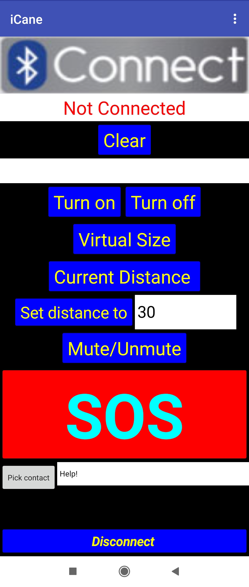
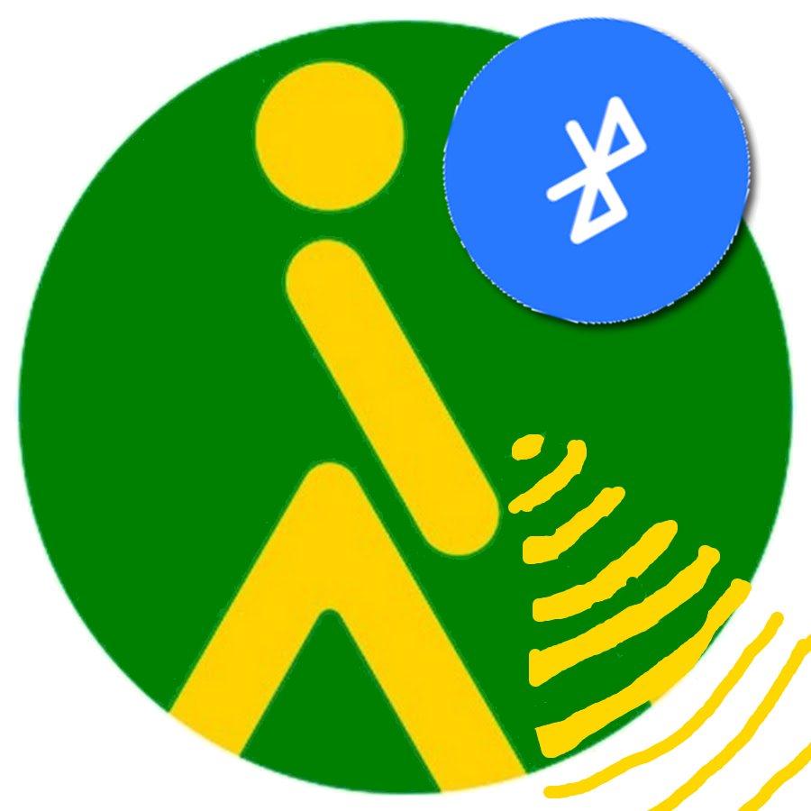
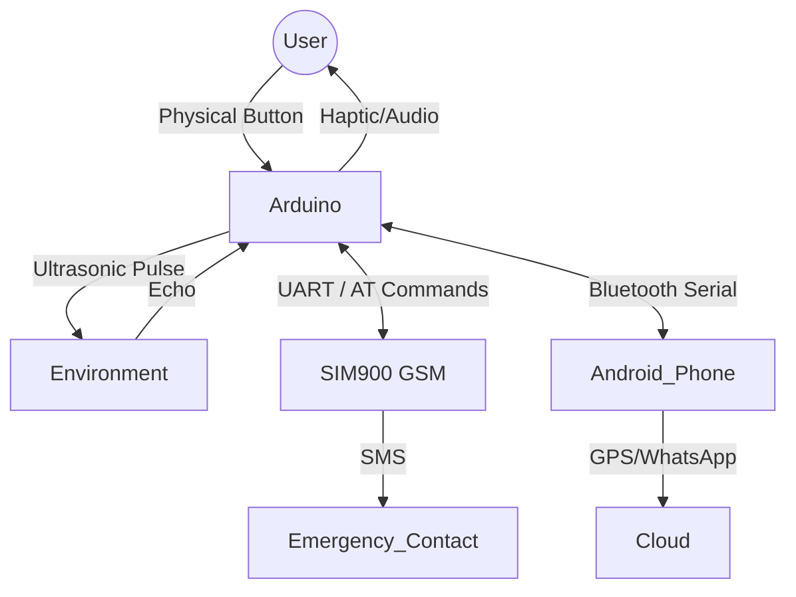

# iCane: Smart Virtual Mobility Aid Ecosystem 🦯📱


> **Jugend Forscht 2021 Entry** | *Engineering, Embedded Systems, & IoT*

**iCane** is a hybrid hardware-software ecosystem designed to modernize assistive technology for the visually impaired. Unlike traditional white canes, iCane utilizes ultrasonic echolocation to create a customizable "virtual cane," providing users with multi-modal haptic and auditory feedback about their environment.

The system features a distributed architecture where an Arduino-based microcontroller handles real-time obstacle detection, while a companion Android application (connected via Bluetooth) leverages the smartphone's GPS and processing power for advanced safety features.

---

## Mobile Companion App

The Android application serves as the control center for the physical cane. It handles high-level logic (GPS tracking, WhatsApp integration) and allows users to calibrate the hardware settings wirelessly.

| **Mobile Dashboard** | **Logo Concept** |
|:---:|:---:|
|  |  |
| *High-contrast navigation dashboard* | *iCane concept Logo* |

---

## Tech Stack

* **Firmware:** C++ (Arduino)
* **Hardware:** Arduino Uno, HC-SR04 Ultrasonic Sensor, SIM900 GSM Module, HC-05 Bluetooth serial module, vibration motor, buzzer, push-button.
* **Mobile App:** Android (MIT App Inventor)
* **Protocols:** UART serial (Bluetooth SPP / Arduino `Serial`), AT commands (SIM900 SMS). The app uses the phone's location sensor (GPS/network) via App Inventor.

---

## Key Features

### 1. The "Virtual Cane" Algorithm
The core of the system is a user-calibrated "virtual length" (e.g., 100cm). The firmware dynamically calculates hazard zones relative to this virtual length, providing intuitive feedback without physical contact.

The current firmware implements three distance zones based on the configured `cm` value:

* **Zone 1 (< 33% of length):** Continuous vibration + short tone (~523 Hz).
* **Zone 2 (33% - 66%):** Pulsed vibration (on/off) + alternating short tones (~523/493 Hz).
* **Zone 3 (66% - 100%):** Slower pulsed vibration + alternating short tones (~523/493 Hz).

Notes:
* The default virtual length in the sketch is **30 cm**, and the app’s textbox is initialized to **30**.
* The sketch uses `pulseIn()` and several `delay()` calls to shape the feedback patterns.

### 2. Distributed Safety System (SOS)
I engineered a redundant safety layer to ensure users can always call for help, regardless of internet availability.
* **Level 1 (GSM Hardware):** A long press of the cane button triggers the SIM900 module to send an SMS via raw AT commands.
    * The destination number is currently hard-coded in the sketch.
* **Level 2 (App Integration):** The Android app has an **SOS button** that opens WhatsApp with a pre-filled message containing the user’s current GPS coordinates (plus accuracy) and a Google Maps link.
    * This is initiated from the phone UI (not from an Arduino-to-app SOS signal in the current code).

### 3. Serial Command Line Interface (CLI)
To allow "on-the-fly" calibration without re-flashing the firmware, I implemented a robust Serial CLI. The mobile app acts as a terminal, sending single-byte characters to configure the hardware.

| Command | Action | Description |
| :--- | :--- | :--- |
| **`s[int]`** | `Set Distance` | Sets the virtual cane length (e.g., `s120` for 120cm). |
| **`m`** | `Mute` | Toggles auditory feedback (Haptic-only mode). |
| **`c`** | `Current Dist` | Returns real-time sensor reading in cm. |
| **`v`** | `View Size` | Returns currently calibrated virtual length. |
| **`b`** | `Uptime` | Returns system uptime (Hours/Mins/Secs). |
| **`+`** | `Turn On` | Turns the cane on (also used to wake from auto-sleep/off). |
| **`-`** | `Turn Off` | Turns the cane off. |
| **`h`** | `Help` | Prints the command list over serial. |

---

## System Architecture

The project solves the challenge of connecting low-level hardware with high-level internet connectivity.



---

## Code Highlights

### Distance Logic & Feedback Loop

The feedback patterns are derived from the user-set `cm` variable.

```cpp
// Snippet from sketch_jan04b.ino
// Calculates hazard zones based on virtual 'cm' length
if (distancia < cm * 1 / 3) {
    // CRITICAL ZONE
    if(sound) tone(buzzer, 523, 100); 
    digitalWrite(motorPin, HIGH); // Max vibration
    interactive = millis();
} 
else if (distancia < cm * 2 / 3) {
    // WARNING ZONE
    if(sound) tone(buzzer, 523, 100);
    digitalWrite(motorPin, HIGH);
    delay(100); 
    // Pulse effect created by toggling motor
    digitalWrite(motorPin, LOW); 
}

```

### GSM "Handshake" Protocol

The sketch uses a raw AT command sequence to send an SOS SMS via SIM900.

```cpp
// Manual AT Command Sequence for Reliability
GPRS.println("AT"); // Handshake
delay(500);
GPRS.println("AT+CMGF=1"); // Set Text Mode
delay(500);
GPRS.println("AT+CMGS=\"+346...\""); // Target Number
delay(500);
GPRS.print("SOS message: Help!"); // Payload
GPRS.write(0x1a); // End of Message Character

```

---

## Hardware Design

* **Auto-Sleep Mode:** To conserve battery, the system tracks the `interactive` timestamp. If no movement or obstacles are detected for 10 minutes (600 seconds), the system enters a low-power state.
* **Modular Build:** The prototype was iteratively designed, moving from Tinkercad simulations to a breadboard prototype, and finally to portable layout.

---

## Wiring (as used in the sketch)

* **HC-SR04:** `Trig` = D12, `Echo` = D11
* **Buzzer:** D9
* **Vibration motor (via driver/transistor):** D6
* **Button:** D4
* **SIM900 (SoftwareSerial):** Arduino D7 = RX (connect to SIM900 TX), Arduino D8 = TX (connect to SIM900 RX)
* **Bluetooth serial (HC-05/HC-06):** connected to Arduino `Serial` (hardware UART). If you wire it to pins 0/1, you generally cannot use the Serial Monitor at the same time.

---

## Impact & Reflection

* **User Testing:** Tested with visually impaired individuals to refine the haptic feedback patterns, ensuring they were distinct and intuitive.
* **Engineering Challenge:** The biggest hurdle was managing the `SoftwareSerial` conflicts between the Bluetooth module and the GSM module, which I resolved by implementing a strict state-machine approach to serial communication.
