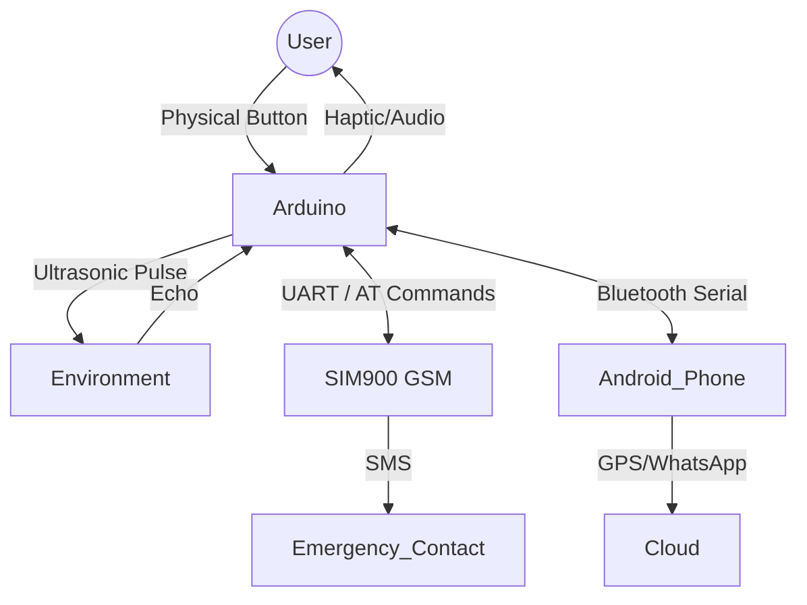

# iCane: Smart Virtual Mobility Aid Ecosystem 🦯📱


> **Jugend Forscht 2021 Entry** | *Engineering, Embedded Systems, & IoT*

**iCane** is a hybrid hardware-software ecosystem designed to modernize assistive technology for the visually impaired. Unlike traditional white canes, iCane utilizes ultrasonic echolocation to create a customizable "virtual cane," providing users with multi-modal haptic and auditory feedback about their environment.

The system features a distributed architecture where an Arduino-based microcontroller handles real-time obstacle detection, while a companion Android application (connected via Bluetooth) leverages the smartphone's GPS and processing power for advanced safety features.

---

## Mobile Companion App

The Android application serves as the control center for the physical cane. It handles high-level logic (GPS tracking, WhatsApp integration) and allows users to calibrate the hardware settings wirelessly.

<p align="center">
  
  
</p>

*Left: The main control dashboard. Right: App Icon.*

---

## Tech Stack

* **Firmware:** C++ (Arduino)
* **Hardware:** Arduino Uno, HC-SR04 Ultrasonic Sensor, SIM900 GSM Module, HC-05 Bluetooth, Haptic Motor.
* **Mobile App:** Android (MIT App Inventor)
* **Protocols:** UART Serial Communication, AT Commands (GSM), NMEA (GPS).

---

## Key Features

### 1. The "Virtual Cane" Algorithm
The core of the system is a user-calibrated "virtual length" (e.g., 100cm). The firmware dynamically calculates hazard zones relative to this virtual length, providing intuitive feedback without physical contact.

* **Zone 1 (< 33% of length):** 🔴 **Critical Hazard.** High-intensity vibration + Rapid high-pitch alarm (C6/1047Hz).
* **Zone 2 (33% - 66%):** 🟡 **Warning.** Pulse vibration + Medium-pitch alert.
* **Zone 3 (66% - 100%):** 🟢 **Detection.** No vibration + Soft low-pitch cue.

### 2. Distributed Safety System (SOS)
I engineered a redundant safety layer to ensure users can always call for help, regardless of internet availability.
* **Level 1 (GSM Hardware):** A physical SOS button on the cane triggers the SIM900 module to send an SMS via raw AT commands.
* **Level 2 (App Integration):** The Android app listens for the SOS signal via Bluetooth and triggers a WhatsApp message containing the user's precise GPS coordinates.

### 3. Serial Command Line Interface (CLI)
To allow "on-the-fly" calibration without re-flashing the firmware, I implemented a robust Serial CLI. The mobile app acts as a terminal, sending single-byte characters to configure the hardware.

| Command | Action | Description |
| :--- | :--- | :--- |
| **`s[int]`** | `Set Distance` | Sets the virtual cane length (e.g., `s120` for 120cm). |
| **`m`** | `Mute` | Toggles auditory feedback (Haptic-only mode). |
| **`c`** | `Current Dist` | Returns real-time sensor reading in cm. |
| **`v`** | `View Size` | Returns currently calibrated virtual length. |
| **`b`** | `Uptime` | Returns system uptime (Hours/Mins/Secs). |

---

## System Architecture

The project solves the challenge of connecting low-level hardware with high-level internet connectivity.



---

## Code Highlights

### Distance Logic & Feedback Loop

The firmware avoids blocking `delay()` calls where possible to maintain responsive sensor readings. The feedback intensity is mathematically derived from the user-set `cm` variable.

```cpp
// Snippet from sketch_jan04b.ino
// Calculates hazard zones based on virtual 'cm' length
if (distancia < cm * 1 / 3) {
    // CRITICAL ZONE
    if(sound) tone(buzzer, 523, 100); 
    digitalWrite(motorPin, HIGH); // Max vibration
    interactive = millis();
} 
else if (distancia < cm * 2 / 3) {
    // WARNING ZONE
    if(sound) tone(buzzer, 523, 100);
    digitalWrite(motorPin, HIGH);
    delay(100); 
    // Pulse effect created by toggling motor
    digitalWrite(motorPin, LOW); 
}

```

### GSM "Handshake" Protocol

Standard libraries for the SIM900 module were unreliable for this specific use case, so I wrote a raw AT command sequence to ensure the SOS message is sent with high priority.

```cpp
// Manual AT Command Sequence for Reliability
GPRS.println("AT"); // Handshake
delay(500);
GPRS.println("AT+CMGF=1"); // Set Text Mode
delay(500);
GPRS.println("AT+CMGS=\"+346...\""); // Target Number
delay(500);
GPRS.print("SOS message: Help!"); // Payload
GPRS.write(0x1a); // End of Message Character

```

---

## Hardware Design

* **Auto-Sleep Mode:** To conserve battery, the system tracks the `interactive` timestamp. If no movement or obstacles are detected for 10 minutes (600 seconds), the system enters a low-power state.
* **Modular Build:** The prototype was iteratively designed, moving from Tinkercad simulations to a breadboard prototype, and finally to portable layout.

---

## Impact & Reflection

* **User Testing:** Tested with visually impaired individuals to refine the haptic feedback patterns, ensuring they were distinct and intuitive.
* **Engineering Challenge:** The biggest hurdle was managing the `SoftwareSerial` conflicts between the Bluetooth module and the GSM module, which I resolved by implementing a strict state-machine approach to serial communication.
